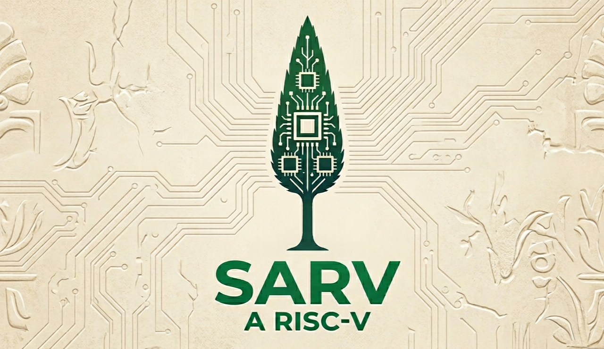

# SARV A Risc-V

  

**SARV** is a 32-bit RISC-V core implementation supporting the RV32I base integer instruction set with multiple extensions. Designed for embedded systems.

---

##  ISA Support

| Extension | Description | Status |
| :--- | :--- | :--- |
| **RV32I** | Base Integer Instructions |  Full |
| **Zmmul** | Integer Multiplication (no division) |  Full |
| **Zicond** | Conditional Operations |  Full |
| **Zihintpause** | Pause Hint Instruction |  Full |

### Compressed Instructions (C)

| Sub-extension | Description | Status |
| :--- | :--- | :--- |
| Zca | Integer Compressed |  Full |

### Bit Manipulation (B)

| Sub-extension | Description | Status |
| :--- | :--- | :--- |
| Zba | Address Generation |  Full |
| Zbb | Basic Bit-Manipulation |  Full |
| Zbs | Single-Bit Operations |  Full |

### Control & Status

| Extension | Description | Status |
| :--- | :--- | :--- |
| **Zicsr** | Control Status Registers |  Full |
| **Zihpm** | Hardware Performance Monitors |  Full |

### Interrupts

| Type | Description | Status |
| :--- | :--- | :--- |
| MEI | Machine External Interrupt | Supported |
| MTI | Machine Timer Interrupt | Supported |
| MSI | Machine Software Interrupt | Supported |

---

##  CoreMark Performance

| Metric | Value |
| :--- | :--- |
| CoreMark | 1433.87 |
| Frequency | 550 MHz (simulated) |
| CoreMark/MHz | 2.61 |
| Simulation | Gate-level, ideal memory |
| Flags      | -march=rv32ib_zicond_zmmul_zicsr -mabi=ilp32 -O3 |

*Measured in gate-level simulation without cache/memory latency. Provides architectural comparison point.*

## Verification

| Test Suite | Status |
| :--- | :--- |
| CoreMark | Pass |
| Custom tests |  In progress |

## Synthesis Results

### Technology: Nangate 45nm Open Cell Library

| Metric | Value |
| :--- | :--- |
| **Total Area** | 28,472 µm² |
| **Sequential Area** | 11,395 µm² (40.0%) |
| **Combinational Area** | ~17,077 µm² (60.0%) |
| **Cell Count** | 19,417 |
| **Flip-Flops (DFFR/DFFS)** | 2,161 |
| **Synthesis Tool** | Yosys |
