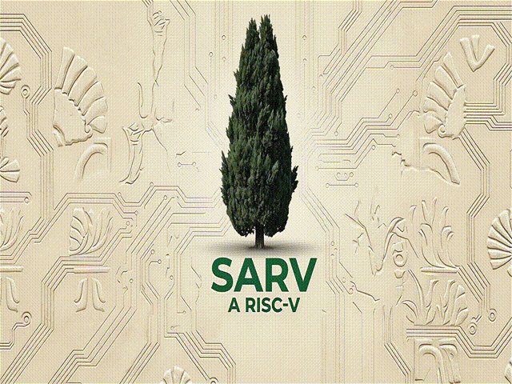

# SARV A Risc-V
<p align="center">
  
</p>

**SARV** is a 32-bit RISC-V processor based on the RV32I ISA. It currently supports **B**, **C**, **Zmmul**, **Zicond**, **Zicsr**, **Zicntr**, **Zihpm**, and **Zihintpause**, together with **machine**, **supervisor**, and **user** privilege modes.

The core is written in Verilog HDL and targets FPGA and ASIC implementations. It is designed as a compact embedded processor with a modular RTL architecture.

---

## Documentation

- [Architectural & ABI Comparisons](docs/architectural_comparisons.md#architectural-comparisons)
- [CSR & interrupts](docs/csr_interrupts.md#csr-interrupts)
- [Critical Path](docs/critical_path.md#critical-path)
- [Power Control](docs/clock_throttling.md#clock-throttling)
- [Branch Prediction](docs/branch_prediction.md#branch-prediction)
- [Return Address Stack](docs/return_address_stack.md#return-address-stack)

## ISA Support

| Extension | Description | Status |
| :--- | :--- | :--- |
| **RV32I** | Base Integer Instructions | Full |
| **Zmmul** | Integer Multiplication (no division) | Full |
| **Zicond** | Conditional Operations | Full |
| **Zihintpause** | Pause Hint Instruction | Full |

### Compressed Instructions (C)

| Sub-extension | Description | Status |
| :--- | :--- | :--- |
| Zca | Integer Compressed Instructions | Full |
| Zcb | Additional Compressed Instructions | Full |

### Bit Manipulation (B)

| Sub-extension | Description | Status |
| :--- | :--- | :--- |
| Zba | Address Generation | Full |
| Zbb | Basic Bit-Manipulation | Full |
| Zbs | Single-Bit Operations | Full |
| Zbc | Carry-less Multiplication | Full |

### Control & Status

| Extension | Description | Status |
| :--- | :--- | :--- |
| **Zicsr** | Control Status Registers | Full |
| **Zicntr** | Base Counters and Timers | Full |
| **Zihpm** | Hardware Performance Monitors | Only mhpmcounter3-9 |

## Privilege Modes

SARV currently implements the three standard RISC-V privilege modes:

| Mode | Description | Status |
| :--- | :--- | :--- |
| **M-mode** | Machine mode | Supported |
| **S-mode** | Supervisor mode | Supported |
| **U-mode** | User mode | Supported |

Supervisor trap and interrupt handling is supported through the corresponding supervisor CSRs and delegation mechanisms.

### Interrupts

### Machine Interrupts

| Interrupt | Description | Status |
| :--- | :--- | :--- |
| MEI | Machine External Interrupt | Supported |
| MTI | Machine Timer Interrupt | Supported |
| MSI | Machine Software Interrupt | Supported |

### Supervisor Interrupts

| Interrupt | Description | Status |
| :--- | :--- | :--- |
| SEI | Supervisor External Interrupt | Supported |
| STI | Supervisor Timer Interrupt | Supported |
| SSI | Supervisor Software Interrupt | Supported |

- Supervisor interrupt delegation is handled through `mideleg`.
- SARV includes support for the **Supervisor-level Timer Compare extension (Sstc)**.


### Power Management

| Feature | Description | Status |
| :--- | :--- | :--- |
| **WFI** | Wait for Interrupt — halts core until IRQ | Supported |
| Clock throttling | Runtime control of switching activity | Supported |

---

## CoreMark Performance

| Metric | Value |
| :--- | :--- |
| CoreMark | 1508.755307 |
| Frequency | 500 MHz (simulated) |
| CoreMark/MHz | 3.017510614 |
| Simulation | Gate-level, ideal memory |
| Flags      | -march=rv32ib_zicond_zmmul_zicsr_zca -mabi=ilp32 -Ofast |

*Measured in gate-level simulation without cache/memory latency. Provides architectural comparison point.*

*The design under test uses:*

- A Branch Target Buffer (BTB) with 8 entries (`BRANCH_PREDICTION_ENTRY_INDEX_BITS = 3`).
- A Return Address Stack (RAS) with 2 entries (`RETURN_ADDRESS_PREDICTION_ENTRY_INDEX_BITS = 1`).
- `ENABLE_CARRY_LESS_MULTIPLIER = 1`.
- `ENABLE_EMBEDDED_BASE = 0`.

## Verification

| Test Suite | Status |
| :--- | :--- |
| CoreMark | Pass |
| unprivilege Custom tests | Pass |
| M/S/U privilege Custom tests | Pass |

## Synthesis Results

### Technology: Nangate 45nm Open Cell Library

| Metric | Value |
| :--- | :--- |
| **Total Area** | 38,354.008000 µm² |
| **Cell Count** | 26,670 |
| **KGE** | 48,06 kGE |
| **Sequential Area** | 16,199.4 µm² (42.24%) |
| **Synthesis Tool** | Yosys |
| **Post-synthesis estimated Fmax** | 550 MHz |

## Architecture

The figure below shows the top level organization of the SARV core. Detailed down to wire and module documentation are available in the `docs/` directory:
[complete schematic](docs/Schematic/schematic.pdf)

<p align="center">
  
</p>

## Simulation

The SARV core has been tested using:

- **Simulator:** QuestaSim 2024.1

### Compile

```sh
vlog rtl/*.v
```

### Run

```sh
vsim work.tb_top
run -all
```

> **Note:** Before running the simulation, update the instruction memory initialization file (`memory.txt`) to point to your desired program image and current path.

## License

SARV is licensed under the **CERN Open Hardware Licence Version 2 – Strongly Reciprocal (CERN-OHL-S-2.0)**.

You are free to use, modify, and manufacture hardware based on this project,
provided you comply with the terms of the CERN-OHL-S v2.

See the [LICENSE](LICENSE) file for details.