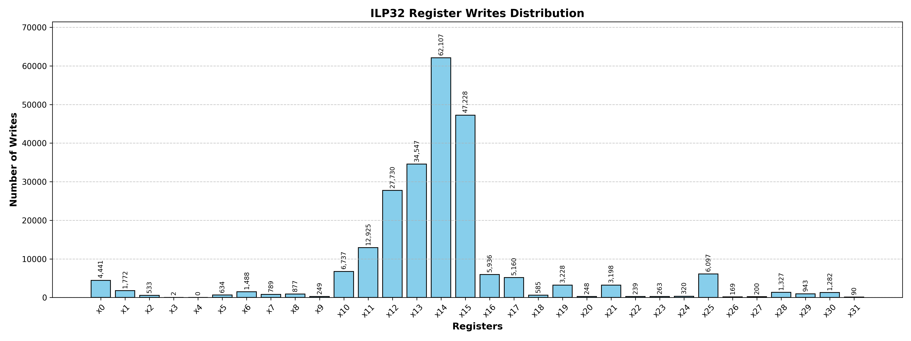
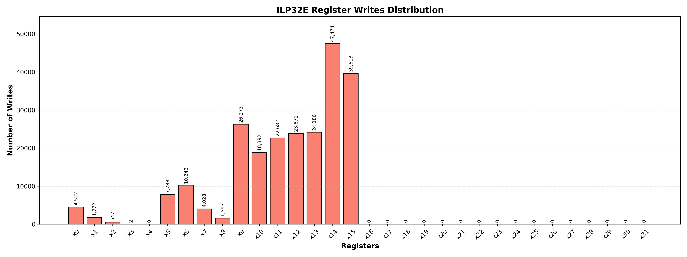
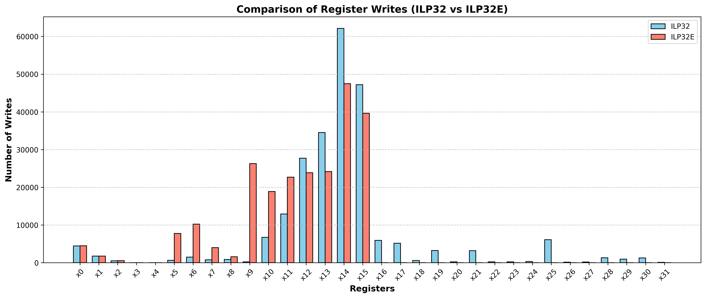

# ABI Comparison: ILP32 vs. ILP32E

This document provides a detailed breakdown of the empirical register usage, performance metrics, and hardware interactions when comparing the standard **ILP32** ABI (`x0`–`x31`) against the embedded **ILP32E** ABI (`x0`–`x15`) on the SARV 32-bit RISC-V processor.

> **Compilation Target / Flags:** `riscv32b_zicond_zmmul_zicsr_zca`  
> **Microarchitecture Parameters:**  
> * `BRANCH_PREDICTION_ENTRY_INDEX_BITS = 3` (8-entry Branch Target Buffer / BTB)
> * `RETURN_ADDRESS_PREDICTION_ENTRY_INDEX_BITS = 1` (2-entry Return Address Stack / RAS)
>
> **Synthesize Technology Node**  `Nangate 45nm, Yosys`

---

## Register Write Distribution Visualizations

### 1. ILP32 ABI Register Writes (`x0`–`x31`)

  

#### Performance & Details (ILP32) for 1 iteration

* **CoreMark Score:** 1508.755307
* **CoreMark / MHz:** 3.017510614
* **Execution Time:** 0.000663 s
* **Total Write Volume:** 231,344 writes across all registers (`x0`–`x31`).
* **Active Register Span:** Full utilization from `x0` to `x31`. 
* **Area:** 34881.644 µm²

---

### 2. ILP32E ABI Register Writes (`x0`–`x15`)

  

#### Performance & Details (ILP32E) for 1 iteration

* **CoreMark Score:** 1486.197682
* **CoreMark / MHz:** 2.972395364
* **Execution Time:** 0.000673 s
* **Total Write Volume:** 233,479 total writes.
* **Active Register Span:** lower half (`x0`–`x15`)
* **Area:** 30444.498 µm²

---

## Summary Comparison Table

| Metric / Parameter | ILP32 ABI (`x0`–`x31`) | ILP32E ABI (`x0`–`x15`) | Delta |
| :--- | :--- | :--- | :--- |
| **CoreMark Performance** | 1508.755307 | 1486.197682 | -1.5%|  
| **CoreMark / MHz** | 3.017510614 | 2.972395364 | -1.5%|  
| **Execution Time** | 0.000663 s | 0.000673 s | -1.5%|  
| **Active Register Span** | `x0` to `x31` (31 registers) | `x0` to `x15` (15 registers) | -52%|  
| **Area** | 34881.644 µm² | 30444.498 µm² | -12.7%|  

**Key note about x0**: x0 is hard-wire to zero .  

  

