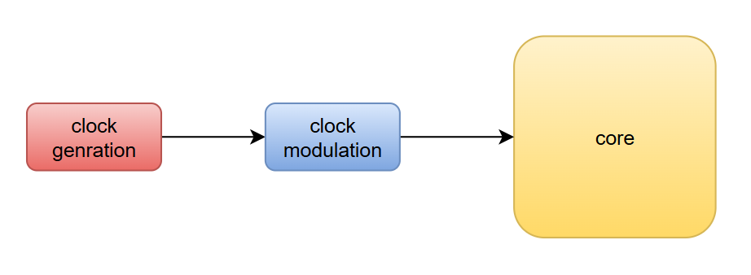
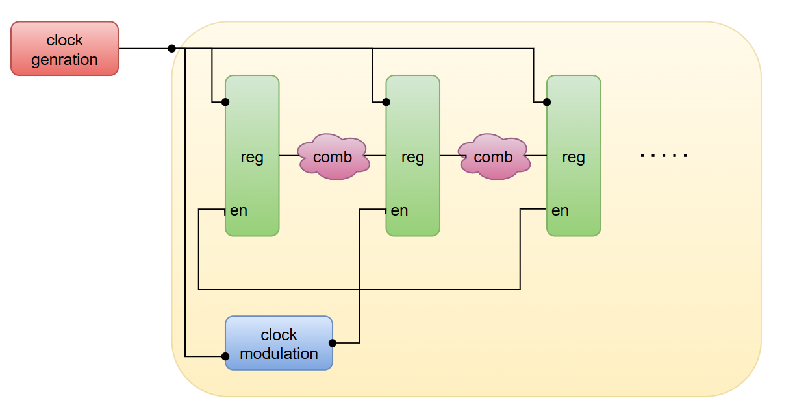

# CPI Manager (Execution Throttling)

The **CPI Manager** is a hardware unit that performs **execution throttling** by injecting programmable pipeline stalls. Unlike Dynamic Voltage and Frequency Scaling (DVFS), the CPI Manager does **not** modify the processor clock frequency or supply voltage. Instead, it temporarily reduces the instruction execution rate while maintaining a constant clock frequency.

The unit is fully programmable through Control and Status Registers (CSRs), allowing software, firmware, or external hardware controllers to dynamically adjust processor performance during runtime.

---

# Motivation

The primary objective of the CPI Manager is **not to replace DVFS**, but to provide an **ultra-fast power management mechanism** capable of responding within a single clock cycle.

Modern DVFS techniques are effective at reducing average power consumption and improving energy efficiency by lowering voltage and frequency. However, DVFS requires PLL/DLL reconfiguration and voltage regulator settling, resulting in transition latencies ranging from microseconds to milliseconds.

During this latency window, short-duration peaks in current and power may still occur. These transient peaks can:

* Increase chip temperature
* Produce excessive instantaneous current demand
* Stress the power delivery network (PDN)
* Reduce long-term device reliability

The CPI Manager addresses this issue by immediately reducing processor activity through programmable stall injection. Since no clock or voltage modifications are required, throttling can begin on the next clock cycle after configuration.

This makes the CPI Manager suitable for:

* Fast mitigation of transient power and current peaks
* Thermal protection before DVFS reacts
* Runtime power budgeting per core
* Embedded systems without DVFS support
* Software-controlled performance management

Rather than competing with DVFS, the CPI Manager is intended to **complement** it: DVFS handles long-term optimization, while CPI Manager handles fast transient control.

---

# Principle of Operation

The processor clock continues operating at its nominal frequency.

Instead of reducing the clock frequency, the CPI Manager prevents the pipeline from advancing by disabling pipeline register enables. During stall cycles:

* The clock continues toggling normally
* Pipeline registers hold their values
* No new instructions progress in the pipeline
* Switching activity is reduced

This reduces dynamic power while preserving timing and clock architecture.

---

# Control Registers

The CPI Manager is configured through two custom machine-mode CSRs:

| CSR      | Address | Description                        |
| -------- | ------- | ---------------------------------- |
| mcpirate | 0x7C0   | Execution throttling configuration |
| mcpictrl | 0x7C4   | Enable and privilege control       |

---

## mcpictrl

| Bits  | Description                     |
| ----- | ------------------------------- |
| [0]   | Enable CPI Manager              |
| [2:1] | Minimum privilege level allowed |
| [7:3] | Reserved                        |

When disabled, the CPI Manager has no effect on execution.

---

## mcpirate

The lower 4 bits define the stall injection intensity, ranging from 0% to 100% execution reduction.

---

# Stall Injection Algorithm

A **24-bit ring counter** generates a rotating one-hot pattern.

A programmable stall mask is derived from `mcpirate`.

When the active ring bit matches the stall mask, `stallCore` is asserted for one cycle, preventing pipeline advancement.

This distributes stalls uniformly over time, avoiding long execution bubbles.

The unit is privilege-aware, allowing different throttling behavior depending on execution level. This ensures high-performance operation during interrupts or kernel execution when configured.

---

# Stall Configuration

| mcpirate | Stall Cycles | Execution Cycles |
| -------- | ------------ | ---------------- |
| 0        | 0 / 24       | 24 / 24          |
| 1        | 1 / 24       | 23 / 24          |
| 2        | 2 / 24       | 22 / 24          |
| 3        | 3 / 24       | 21 / 24          |
| 4        | 4 / 24       | 20 / 24          |
| 5        | 6 / 24       | 18 / 24          |
| 6        | 8 / 24       | 16 / 24          |
| 7        | 12 / 24      | 12 / 24          |
| 8        | 12 / 24      | 12 / 24          |
| 9        | 16 / 24      | 8 / 24           |
| 10       | 18 / 24      | 6 / 24           |
| 11       | 20 / 24      | 4 / 24           |
| 12       | 21 / 24      | 3 / 24           |
| 13       | 22 / 24      | 2 / 24           |
| 14       | 23 / 24      | 1 / 24           |
| 15       | 24 / 24      | 0 / 24           |

---

# Interaction with Memory Wait States

The CPI Manager monitors the instruction memory wait signal.

After a memory stall, throttling is temporarily suppressed to avoid stacking additional delay on top of memory latency. This ensures smooth interaction between memory stalls and execution throttling.

---

# Power Analysis

The total power of a CMOS processor is approximated by:

$$
P_{total} = \alpha C V_{DD}^{2} f + I_{sc} V_{DD} + I_{leak} V_{DD}
$$

Where:

* $\alpha$: switching activity factor  
* $C$: switched capacitance  
* $V_{DD}$: supply voltage  
* $f$: clock frequency  

The CPI Manager does **not change**:

* Clock frequency $f$
* Supply voltage $V_{DD}$

Instead, it reduces the switching activity factor $\alpha$ by limiting pipeline progression.

---

# Clock Modulation vs Execution Throttling

## Traditional Clock Modulation

  

## CPI Manager Stall Modulation

  

Unlike clock modulation, the CPI Manager keeps the clock active and only controls pipeline progression.

---

# Comparison with DVFS

| Feature                 | DVFS     | CPI Manager      |
| ----------------------- | -------- | ---------------- |
| Clock Frequency         | Variable | Fixed            |
| Supply Voltage          | Variable | Fixed            |
| Dynamic Power Reduction | High     | Moderate         |
| Leakage Reduction       | Possible | Minimal          |
| Clock Tree Changes      | Required | Not Required     |
| Voltage Regulators      | Required | Not Required     |
| PLL Reconfiguration     | Required | Not Required     |
| Transition Latency      | ms       | 1 cycle          |
| Runtime Control         | Limited  | Full CSR control |
| Hardware Complexity     | High     | Low              |

---

# Experimental Results

Power estimation was performed using a synthesized SARV core on the **Nangate 45nm library** with **OpenSTA analysis**.

Measurements show that each **1% reduction in execution rate results in ~0.78% reduction in power consumption**, depending on workload activity.

---

# Summary

The CPI Manager provides a lightweight and fast execution throttling mechanism for runtime power control.

It enables immediate reduction of processor activity without modifying clock frequency or voltage, making it particularly effective for transient power peaks, thermal protection, and power budgeting.

It complements DVFS by operating at a much faster reaction time, addressing short-term power instability while DVFS handles long-term efficiency optimization.
